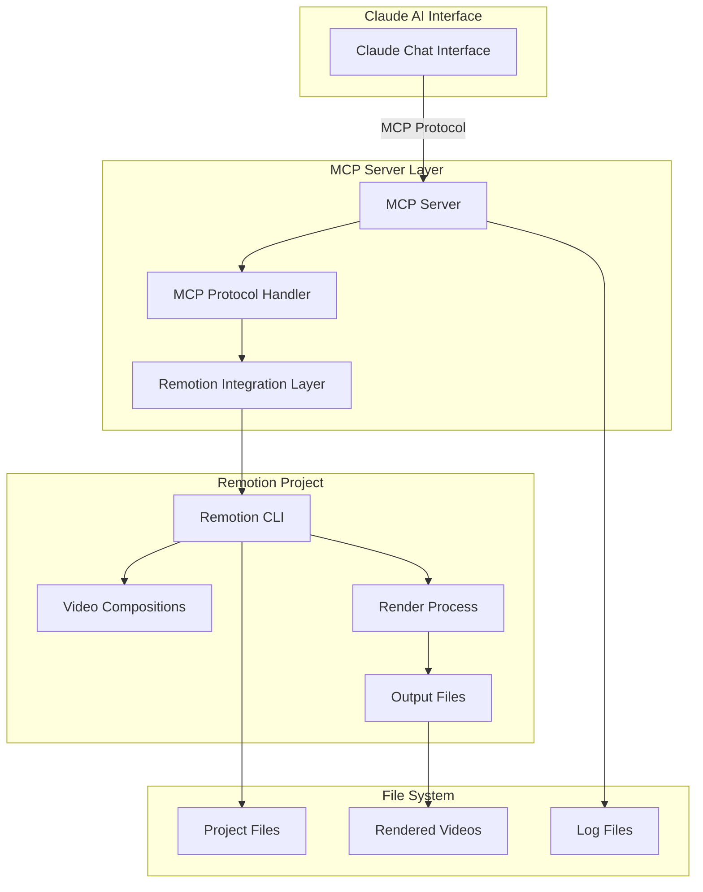
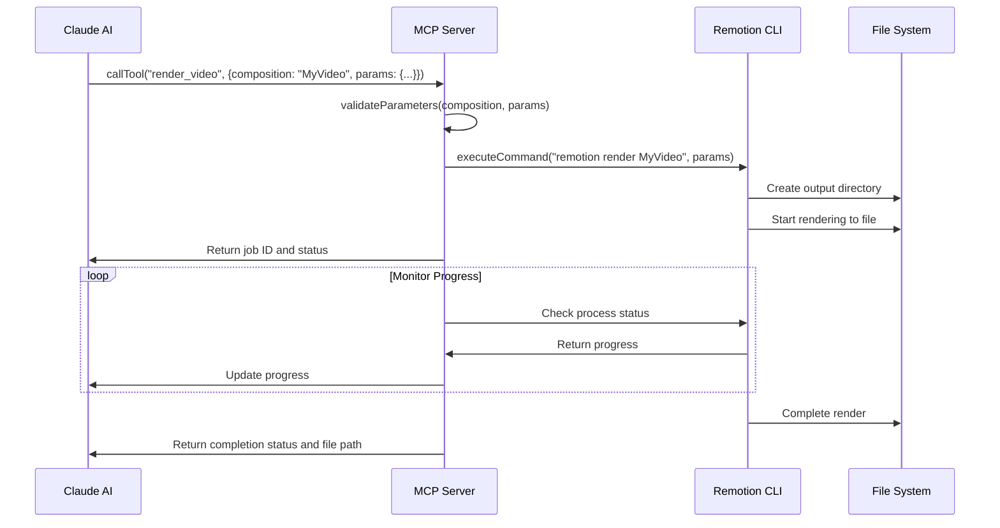
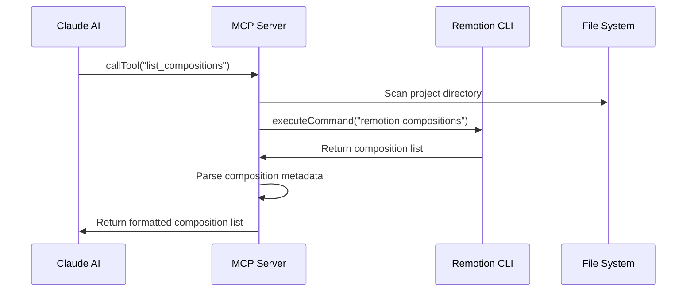
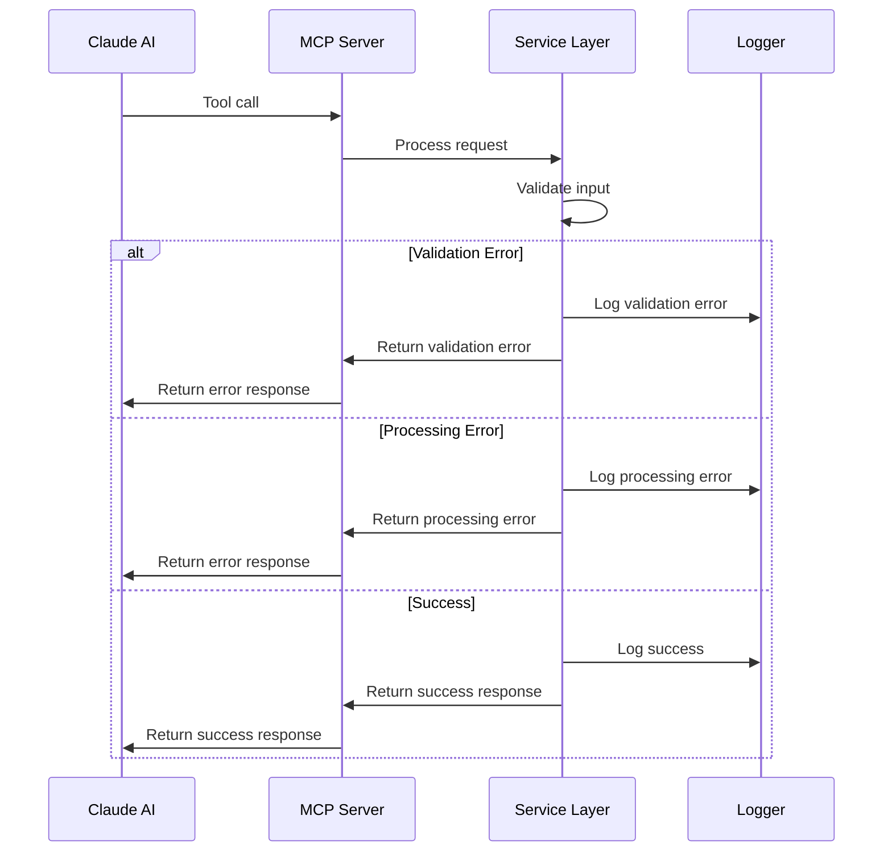

# Remotion MCP Server Integration Fullstack Architecture Document

## Introduction

This document outlines the complete fullstack architecture for Remotion MCP Server Integration, including backend systems, frontend implementation, and their integration. It serves as the single source of truth for AI-driven development, ensuring consistency across the entire technology stack.

This unified approach combines what would traditionally be separate backend and frontend architecture documents, streamlining the development process for modern fullstack applications where these concerns are increasingly intertwined.

### Starter Template or Existing Project
N/A - Greenfield project. The MCP server will be integrated into the existing Remotion project structure as a new module.

### Change Log
| Date | Version | Description | Author |
|------|---------|-------------|---------|
| 2024-12-19 | 1.0 | Initial architecture creation | Architect Agent |

## High Level Architecture

### Technical Summary
The Remotion MCP Server Integration follows a modular, stateless architecture that integrates seamlessly with existing Remotion projects. The MCP server operates as a Node.js/TypeScript service that implements the Model Context Protocol (MCP) standard, enabling Claude AI to control Remotion video rendering through natural language commands. The architecture emphasizes performance, reliability, and maintainability while maintaining backward compatibility with existing Remotion CLI operations.

### Platform and Infrastructure Choice
**Platform:** Local Development Environment
**Key Services:** Node.js runtime, File system storage, Process management
**Deployment Host and Regions:** Local development environment with potential for containerization

### Repository Structure
**Structure:** Monorepo (existing Remotion project)
**Monorepo Tool:** npm workspaces
**Package Organization:** MCP server as separate package within existing project structure

### High Level Architecture Diagram



### Architectural Patterns
- **MCP Protocol Pattern:** Standardized communication protocol between AI assistants and tools
- **Stateless Service Pattern:** MCP server maintains no persistent state between requests
- **Command Pattern:** Encapsulates render operations as commands with parameters
- **Observer Pattern:** Monitors render progress and provides real-time updates
- **Repository Pattern:** Abstracts Remotion CLI interactions for testability
- **Factory Pattern:** Creates render processes with different configurations

## Tech Stack

| Category | Technology | Version | Purpose | Rationale |
|----------|------------|---------|---------|-----------|
| Backend Language | TypeScript | 5.0+ | MCP server implementation | Type safety and modern JavaScript features |
| Backend Framework | Node.js | 18+ | Runtime environment | Native async/await support and MCP compatibility |
| MCP Protocol | @modelcontextprotocol/sdk | Latest | MCP protocol implementation | Official SDK for MCP compliance |
| Process Management | child_process | Native | Remotion CLI execution | Direct integration with system processes |
| File System | fs/promises | Native | File operations | Modern async file system API |
| Configuration | dotenv | Latest | Environment configuration | Standard configuration management |
| Logging | winston | Latest | Structured logging | Comprehensive logging with multiple transports |
| Testing | Jest | Latest | Unit and integration testing | Comprehensive testing framework |
| Build Tool | esbuild | Latest | TypeScript compilation | Fast build times for development |
| Process Monitoring | node-ps | Latest | Process status monitoring | Cross-platform process management |
| Validation | zod | Latest | Parameter validation | Runtime type validation with TypeScript integration |
| Error Handling | custom | - | Error management | Tailored error handling for MCP protocol |

## Data Models

### RenderJob
**Purpose:** Represents a video rendering job with its current status and parameters

**Key Attributes:**
- id: string - Unique identifier for the render job
- compositionName: string - Name of the Remotion composition to render
- parameters: RenderParameters - Configuration parameters for the render
- status: RenderStatus - Current status of the render (pending, running, completed, failed)
- progress: number - Progress percentage (0-100)
- startTime: Date - When the render started
- endTime?: Date - When the render completed
- outputPath?: string - Path to the rendered video file
- errorMessage?: string - Error message if render failed

#### TypeScript Interface
```typescript
interface RenderJob {
  id: string;
  compositionName: string;
  parameters: RenderParameters;
  status: RenderStatus;
  progress: number;
  startTime: Date;
  endTime?: Date;
  outputPath?: string;
  errorMessage?: string;
}

type RenderStatus = 'pending' | 'running' | 'completed' | 'failed' | 'cancelled';

interface RenderParameters {
  width?: number;
  height?: number;
  fps?: number;
  duration?: number;
  quality?: number;
  format?: 'mp4' | 'webm' | 'gif';
  [key: string]: any;
}
```

#### Relationships
- RenderJob belongs to a Composition
- RenderJob produces OutputFile
- RenderJob has multiple StatusUpdates

### Composition
**Purpose:** Represents a Remotion video composition with its metadata and available parameters

**Key Attributes:**
- name: string - Name of the composition
- duration: number - Duration in frames
- fps: number - Frames per second
- width: number - Video width
- height: number - Video height
- parameters: CompositionParameter[] - Available parameters for customization

#### TypeScript Interface
```typescript
interface Composition {
  name: string;
  duration: number;
  fps: number;
  width: number;
  height: number;
  parameters: CompositionParameter[];
}

interface CompositionParameter {
  name: string;
  type: 'string' | 'number' | 'boolean' | 'object';
  defaultValue?: any;
  required: boolean;
  description: string;
  constraints?: ParameterConstraint;
}

interface ParameterConstraint {
  min?: number;
  max?: number;
  pattern?: string;
  enum?: string[];
}
```

#### Relationships
- Composition has many RenderJobs
- Composition has many CompositionParameters

## API Specification

### MCP Protocol Implementation

The MCP server implements the following MCP protocol methods:

#### Initialize
```typescript
interface InitializeRequest {
  protocolVersion: string;
  capabilities: {
    tools: {};
    resources: {};
  };
  clientInfo: {
    name: string;
    version: string;
  };
}

interface InitializeResponse {
  protocolVersion: string;
  capabilities: {
    tools: {};
    resources: {};
  };
  serverInfo: {
    name: string;
    version: string;
  };
}
```

#### List Tools
```typescript
interface ListToolsResponse {
  tools: Tool[];
}

interface Tool {
  name: string;
  description: string;
  inputSchema: {
    type: string;
    properties: Record<string, any>;
    required: string[];
  };
}
```

#### Call Tool
```typescript
interface CallToolRequest {
  name: string;
  arguments: Record<string, any>;
}

interface CallToolResponse {
  content: Array<{
    type: string;
    text: string;
  }>;
}
```

## Components

### MCP Protocol Handler
**Responsibility:** Handles MCP protocol communication with Claude AI

**Key Interfaces:**
- initialize(version, capabilities, clientInfo): InitializeResponse
- listTools(): ListToolsResponse
- callTool(name, arguments): CallToolResponse

**Dependencies:** RemotionIntegration, ErrorHandler, Logger

**Technology Stack:** @modelcontextprotocol/sdk, TypeScript

### Remotion Integration Layer
**Responsibility:** Manages interaction with Remotion CLI and project files

**Key Interfaces:**
- discoverCompositions(): Composition[]
- validateProject(): ValidationResult
- startRender(composition, parameters): RenderJob
- getRenderStatus(jobId): RenderJob
- cancelRender(jobId): boolean

**Dependencies:** ProcessManager, FileSystem, Configuration

**Technology Stack:** child_process, fs/promises, path

### Process Manager
**Responsibility:** Manages Remotion CLI processes and monitoring

**Key Interfaces:**
- executeCommand(command, args): ProcessResult
- monitorProcess(processId): ProcessStatus
- killProcess(processId): boolean

**Dependencies:** Logger, ErrorHandler

**Technology Stack:** child_process, node-ps

### Parameter Validator
**Responsibility:** Validates render parameters and composition configurations

**Key Interfaces:**
- validateParameters(composition, parameters): ValidationResult
- parseNaturalLanguage(text): ParsedParameters
- getParameterSchema(composition): ParameterSchema

**Dependencies:** CompositionDiscovery

**Technology Stack:** zod, natural language processing

### Error Handler
**Responsibility:** Centralized error handling and user-friendly error messages

**Key Interfaces:**
- handleError(error, context): ErrorResponse
- categorizeError(error): ErrorCategory
- formatErrorMessage(error): string

**Dependencies:** Logger

**Technology Stack:** Custom error handling, winston

## External APIs

### Remotion CLI Integration
- **Purpose:** Execute Remotion commands programmatically
- **Documentation:** https://www.remotion.dev/docs/cli
- **Base URL(s):** Local CLI commands
- **Authentication:** None (local execution)
- **Rate Limits:** None (local execution)

**Key Endpoints Used:**
- `remotion render <composition>` - Render video composition
- `remotion compositions` - List available compositions
- `remotion preview <composition>` - Preview composition

**Integration Notes:** Direct CLI execution through child_process with output parsing

## Core Workflows

### Render Video Workflow



### Composition Discovery Workflow



## Database Schema

N/A - This is a stateless service that doesn't require persistent database storage. All state is maintained in memory during server runtime.

## Frontend Architecture

N/A - This is a backend-only service. The user interface is provided through Claude's chat interface.

## Backend Architecture

### Service Architecture

#### Traditional Server Architecture
The MCP server follows a traditional Node.js server architecture with modular components.

#### Controller/Route Organization
```
src/
├── server.ts              # Main server entry point
├── handlers/
│   ├── mcp-handler.ts     # MCP protocol handlers
│   └── tool-handlers.ts   # Tool-specific handlers
├── services/
│   ├── remotion-service.ts # Remotion integration
│   ├── process-service.ts  # Process management
│   └── validation-service.ts # Parameter validation
├── models/
│   ├── render-job.ts      # Render job model
│   ├── composition.ts     # Composition model
│   └── types.ts          # TypeScript types
├── utils/
│   ├── logger.ts         # Logging utilities
│   ├── error-handler.ts  # Error handling
│   └── config.ts         # Configuration
└── tests/
    ├── unit/             # Unit tests
    └── integration/      # Integration tests
```

#### Controller Template
```typescript
import { MCPClient } from '@modelcontextprotocol/sdk';
import { RemotionService } from '../services/remotion-service';
import { Logger } from '../utils/logger';

export class MCPHandler {
  private remotionService: RemotionService;
  private logger: Logger;

  constructor() {
    this.remotionService = new RemotionService();
    this.logger = new Logger();
  }

  async handleInitialize(request: InitializeRequest): Promise<InitializeResponse> {
    try {
      this.logger.info('Initializing MCP server', { clientInfo: request.clientInfo });
      
      return {
        protocolVersion: '2024-11-05',
        capabilities: {
          tools: {},
          resources: {}
        },
        serverInfo: {
          name: 'remotion-mcp-server',
          version: '1.0.0'
        }
      };
    } catch (error) {
      this.logger.error('Initialization failed', { error });
      throw error;
    }
  }

  async handleListTools(): Promise<ListToolsResponse> {
    return {
      tools: [
        {
          name: 'list_compositions',
          description: 'List available Remotion compositions',
          inputSchema: {
            type: 'object',
            properties: {},
            required: []
          }
        },
        {
          name: 'render_video',
          description: 'Render a video composition with specified parameters',
          inputSchema: {
            type: 'object',
            properties: {
              composition: { type: 'string' },
              parameters: { type: 'object' }
            },
            required: ['composition']
          }
        }
      ]
    };
  }
}
```

### Database Architecture
N/A - No persistent database required for this stateless service.

### Authentication and Authorization
N/A - Local execution only, no authentication required.

## Unified Project Structure

```
emlinh-remotion/
├── src/                          # Existing Remotion source
├── public/                       # Existing public assets
├── mcp-server/                   # New MCP server package
│   ├── src/
│   │   ├── server.ts            # Main server entry point
│   │   ├── handlers/
│   │   │   ├── mcp-handler.ts   # MCP protocol handlers
│   │   │   └── tool-handlers.ts # Tool-specific handlers
│   │   ├── services/
│   │   │   ├── remotion-service.ts
│   │   │   ├── process-service.ts
│   │   │   └── validation-service.ts
│   │   ├── models/
│   │   │   ├── render-job.ts
│   │   │   ├── composition.ts
│   │   │   └── types.ts
│   │   ├── utils/
│   │   │   ├── logger.ts
│   │   │   ├── error-handler.ts
│   │   │   └── config.ts
│   │   └── tests/
│   │       ├── unit/
│   │       └── integration/
│   ├── package.json
│   ├── tsconfig.json
│   └── README.md
├── docs/                         # Documentation
│   ├── prd.md
│   ├── brief.md
│   └── architecture.md
├── package.json                  # Root package.json with workspaces
├── tsconfig.json
└── README.md
```

## Development Workflow

### Local Development Setup

#### Prerequisites
```bash
# Install Node.js 18+
node --version

# Install Remotion CLI
npm install -g @remotion/cli

# Verify Remotion project setup
remotion --version
```

#### Initial Setup
```bash
# Install dependencies
npm install

# Install MCP server dependencies
cd mcp-server
npm install

# Build MCP server
npm run build

# Start MCP server
npm start
```

#### Development Commands
```bash
# Start MCP server in development mode
cd mcp-server
npm run dev

# Run tests
npm test

# Run integration tests
npm run test:integration

# Build for production
npm run build

# Start production server
npm start
```

### Environment Configuration

#### Required Environment Variables
```bash
# MCP Server (.env)
REMOTION_PROJECT_PATH=../src
LOG_LEVEL=info
PORT=3001

# Remotion Configuration
REMOTION_OUTPUT_DIR=./output
REMOTION_CACHE_DIR=./cache
```

## Deployment Architecture

### Deployment Strategy
**MCP Server Deployment:**
- **Platform:** Local development environment
- **Build Command:** `npm run build`
- **Output Directory:** `dist/`
- **Deployment Method:** Local Node.js process

### CI/CD Pipeline
```yaml
name: MCP Server CI/CD

on:
  push:
    branches: [main]
  pull_request:
    branches: [main]

jobs:
  test:
    runs-on: ubuntu-latest
    steps:
      - uses: actions/checkout@v3
      - uses: actions/setup-node@v3
        with:
          node-version: '18'
      - run: npm ci
      - run: npm test
      - run: npm run test:integration

  build:
    needs: test
    runs-on: ubuntu-latest
    steps:
      - uses: actions/checkout@v3
      - uses: actions/setup-node@v3
        with:
          node-version: '18'
      - run: npm ci
      - run: npm run build
```

### Environments
| Environment | MCP Server URL | Purpose |
|-------------|----------------|---------|
| Development | localhost:3001 | Local development |
| Production | localhost:3001 | Production deployment |

## Security and Performance

### Security Requirements
**MCP Server Security:**
- Input Validation: All parameters validated using Zod schemas
- Rate Limiting: Not applicable (local execution)
- Process Isolation: Render processes run in isolated environment
- File System Security: Restricted access to project directories only

### Performance Optimization
**MCP Server Performance:**
- Response Time Target: <5 seconds for all operations
- Process Management: Efficient process monitoring and cleanup
- Memory Management: Stateless design minimizes memory usage
- Caching Strategy: Composition discovery results cached in memory

## Testing Strategy

### Testing Pyramid
```
E2E Tests (MCP Protocol)
    |
Integration Tests (Remotion CLI)
    |
Unit Tests (Services, Utils)
```

### Test Organization
```
mcp-server/tests/
├── unit/
│   ├── services/
│   ├── handlers/
│   └── utils/
├── integration/
│   ├── remotion-cli.test.ts
│   └── mcp-protocol.test.ts
└── e2e/
    └── full-workflow.test.ts
```

### Test Examples

#### Unit Test Example
```typescript
import { RemotionService } from '../services/remotion-service';
import { mockComposition } from '../mocks/composition';

describe('RemotionService', () => {
  let service: RemotionService;

  beforeEach(() => {
    service = new RemotionService();
  });

  describe('discoverCompositions', () => {
    it('should return list of compositions', async () => {
      const compositions = await service.discoverCompositions();
      expect(compositions).toHaveLength(1);
      expect(compositions[0]).toEqual(mockComposition);
    });
  });
});
```

#### Integration Test Example
```typescript
import { MCPHandler } from '../handlers/mcp-handler';

describe('MCP Protocol Integration', () => {
  let handler: MCPHandler;

  beforeEach(() => {
    handler = new MCPHandler();
  });

  it('should handle render video tool call', async () => {
    const response = await handler.handleCallTool({
      name: 'render_video',
      arguments: {
        composition: 'MyVideo',
        parameters: { width: 1920, height: 1080 }
      }
    });

    expect(response.content[0].text).toContain('Render job started');
  });
});
```

## Coding Standards

### Critical Fullstack Rules
- **Type Safety:** All code must use TypeScript with strict mode enabled
- **Error Handling:** All async operations must have proper error handling
- **Logging:** All operations must be logged with appropriate levels
- **Testing:** All new features must have corresponding unit tests
- **MCP Compliance:** All MCP protocol implementations must follow official specification
- **Process Management:** All child processes must be properly managed and cleaned up

### Naming Conventions
| Element | Convention | Example |
|---------|------------|---------|
| Classes | PascalCase | `RemotionService` |
| Functions | camelCase | `discoverCompositions` |
| Variables | camelCase | `renderJob` |
| Constants | UPPER_SNAKE_CASE | `DEFAULT_TIMEOUT` |
| Files | kebab-case | `remotion-service.ts` |
| Directories | kebab-case | `mcp-server/` |

## Error Handling Strategy

### Error Flow


### Error Response Format
```typescript
interface MCPError {
  error: {
    code: string;
    message: string;
    details?: Record<string, any>;
    timestamp: string;
    requestId: string;
  };
}

interface ValidationError extends MCPError {
  error: {
    code: 'VALIDATION_ERROR';
    message: string;
    details: {
      field: string;
      value: any;
      constraint: string;
    };
  };
}

interface ProcessingError extends MCPError {
  error: {
    code: 'PROCESSING_ERROR';
    message: string;
    details: {
      operation: string;
      reason: string;
    };
  };
}
```

### Backend Error Handling
```typescript
export class ErrorHandler {
  static handleError(error: Error, context: string): MCPError {
    const logger = new Logger();
    
    logger.error('Error occurred', { error, context });
    
    if (error instanceof ValidationError) {
      return {
        error: {
          code: 'VALIDATION_ERROR',
          message: error.message,
          details: error.details,
          timestamp: new Date().toISOString(),
          requestId: this.generateRequestId()
        }
      };
    }
    
    return {
      error: {
        code: 'INTERNAL_ERROR',
        message: 'An internal error occurred',
        details: { context },
        timestamp: new Date().toISOString(),
        requestId: this.generateRequestId()
      }
    };
  }
}
```

## Monitoring and Observability

### Monitoring Stack
- **MCP Server Monitoring:** Built-in logging with Winston
- **Process Monitoring:** Node.js process monitoring
- **Error Tracking:** Structured error logging
- **Performance Monitoring:** Response time tracking

### Key Metrics
**MCP Server Metrics:**
- Request rate and response times
- Error rate by operation type
- Process execution times
- Memory usage and cleanup

**Remotion Integration Metrics:**
- Render success/failure rates
- Average render duration
- Composition discovery performance
- CLI command execution times

## Checklist Results Report

[To be populated after running architect checklist]
