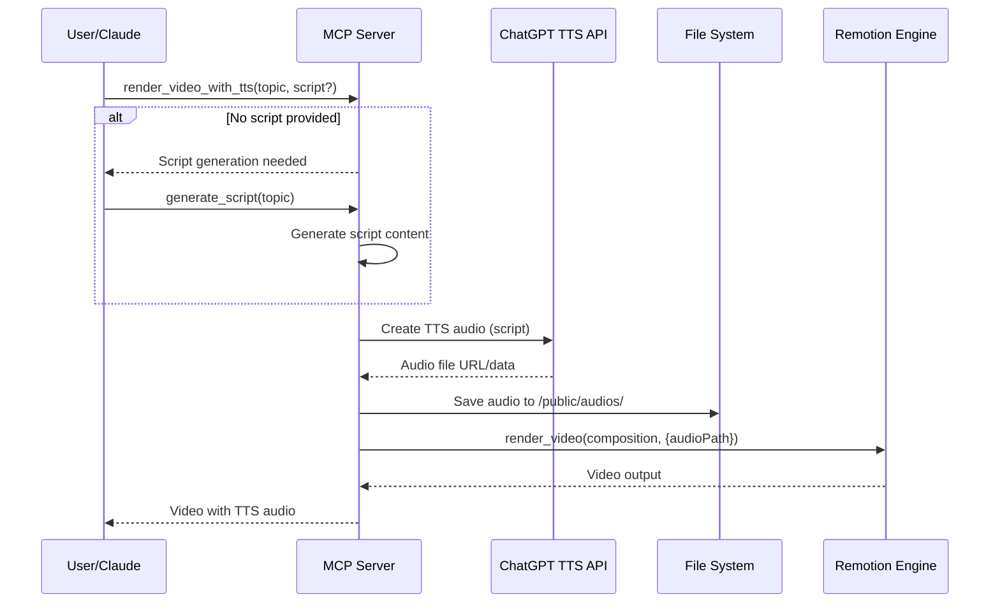

# TTS Integration Architecture Documentation

## Tổng quan

Tài liệu này mô tả kiến trúc tích hợp ChatGPT TTS vào MCP-Remotion Server, cho phép tự động tạo audio từ text và render video với voice-over.

## Kiến trúc hệ thống

### Sơ đồ tổng quan

```
┌─────────────────────────────────────────────────────────────┐
│                    MCP Server Layer                         │
├─────────────────────────────────────────────────────────────┤
│  Tools: render_video_with_tts | generate_tts_audio         │
│         generate_script | manage_audio_files               │
└─────────────────────────────────────────────────────────────┘
                              │
┌─────────────────────────────────────────────────────────────┐
│                   Handler Layer                             │
├─────────────────────────────────────────────────────────────┤
│  AudioHandlers │ ScriptHandlers │ EnhancedRenderHandlers   │
└─────────────────────────────────────────────────────────────┘
                              │
┌─────────────────────────────────────────────────────────────┐
│                   Service Layer                             │
├─────────────────────────────────────────────────────────────┤
│  TTSService │ ScriptService │ AudioManager │ RenderService  │
└─────────────────────────────────────────────────────────────┘
                              │
┌─────────────────────────────────────────────────────────────┐
│                 External APIs & Storage                     │
├─────────────────────────────────────────────────────────────┤
│  OpenAI TTS API │ File System │ Remotion Engine            │
└─────────────────────────────────────────────────────────────┘
```

### Flow hoạt động



## Components chi tiết

### 1. Service Layer

#### TTSService
```typescript
interface ITTSService {
  generateAudio(request: TTSRequest): Promise<TTSResponse>;
  listVoices(): Promise<Voice[]>;
  validateApiKey(): Promise<boolean>;
  estimateTokens(text: string): number;
}
```

**Chức năng:**
- Tích hợp OpenAI TTS API
- Quản lý voice options và quality settings
- Xử lý retry logic và error handling
- Token estimation và cost calculation

#### ScriptService
```typescript
interface IScriptService {
  generateScript(topic: string, options?: ScriptOptions): Promise<Script>;
  validateScript(script: string): ValidationResult;
  getTemplates(): ScriptTemplate[];
}
```

**Chức năng:**
- Template-based script generation
- Content validation và formatting
- Multi-language support (Vi/En)
- Tone và style customization

#### AudioManager
```typescript
interface IAudioManager {
  saveAudio(audioData: Buffer, metadata: AudioMetadata): Promise<string>;
  getAudio(audioId: string): Promise<AudioFile>;
  listAudios(filter?: AudioFilter): Promise<AudioFile[]>;
  deleteAudio(audioId: string): Promise<void>;
  cleanup(olderThan: Date): Promise<number>;
}
```

**Chức năng:**
- File lifecycle management
- Metadata tracking
- Storage optimization
- Automatic cleanup policies

### 2. Handler Layer

#### AudioHandlers
- `generate_tts_audio` - Direct TTS generation
- `list_audio_files` - Audio file listing
- `delete_audio_file` - File cleanup
- `get_audio_metadata` - File information

#### ScriptHandlers
- `generate_script` - Script creation từ topic
- `validate_script` - Content validation
- `list_script_templates` - Available templates

#### EnhancedRenderHandlers
- `render_video_with_tts` - All-in-one workflow
- Enhanced existing render tools với TTS support

### 3. Data Models

#### Core Types
```typescript
// TTS Request/Response
export interface TTSRequest {
  text: string;
  voice: TTSVoice;
  model: TTSModel;
  speed?: number;
  responseFormat?: 'mp3' | 'opus' | 'aac' | 'flac';
}

export interface TTSResponse {
  audioId: string;
  filePath: string;
  duration: number;
  size: number;
  format: string;
  metadata: TTSMetadata;
}

// Voice và Model Options
export type TTSVoice = 'alloy' | 'echo' | 'fable' | 'onyx' | 'nova' | 'shimmer';
export type TTSModel = 'tts-1' | 'tts-1-hd';

// Script Management
export interface Script {
  id: string;
  topic: string;
  content: string;
  wordCount: number;
  estimatedDuration: number;
  template: string;
  createdAt: Date;
}

// Audio File Management
export interface AudioFile {
  id: string;
  filename: string;
  filePath: string;
  duration: number;
  size: number;
  format: string;
  voice: TTSVoice;
  model: TTSModel;
  scriptId?: string;
  createdAt: Date;
  metadata: AudioMetadata;
}
```

## Error Handling Strategy

### Error Types Hierarchy
```typescript
export class TTSError extends Error {
  constructor(
    message: string,
    public code: TTSErrorCode,
    public details?: Record<string, unknown>
  ) {
    super(message);
    this.name = 'TTSError';
  }
}

export enum TTSErrorCode {
  API_KEY_INVALID = 'TTS_API_KEY_INVALID',
  API_RATE_LIMIT = 'TTS_API_RATE_LIMIT',
  API_QUOTA_EXCEEDED = 'TTS_API_QUOTA_EXCEEDED',
  TEXT_TOO_LONG = 'TTS_TEXT_TOO_LONG',
  INVALID_VOICE = 'TTS_INVALID_VOICE',
  AUDIO_GENERATION_FAILED = 'TTS_AUDIO_GENERATION_FAILED',
  FILE_SAVE_FAILED = 'TTS_FILE_SAVE_FAILED',
  NETWORK_ERROR = 'TTS_NETWORK_ERROR'
}
```

### Resilience Patterns
- **Circuit Breaker**: Tạm dừng API calls khi failure rate cao
- **Exponential Backoff**: Tăng delay giữa các retry attempts
- **Graceful Degradation**: Fallback về cached audio hoặc default voice
- **Request Queuing**: Queue requests khi hit rate limits

## Configuration

### Environment Variables
```bash
# OpenAI API Configuration
OPENAI_API_KEY=sk-...
OPENAI_TTS_MODEL=tts-1
OPENAI_TTS_VOICE=alloy

# Audio Settings
AUDIO_OUTPUT_DIR=./public/audios
AUDIO_FORMAT=mp3
AUDIO_QUALITY=standard
AUDIO_SPEED=1.0

# Cleanup Policies
AUDIO_RETENTION_HOURS=24
MAX_AUDIO_FILES=100
AUTO_CLEANUP_ENABLED=true

# Rate Limiting
TTS_MAX_CONCURRENT_REQUESTS=3
TTS_RATE_LIMIT_PER_MINUTE=50
```

### Default Settings
```typescript
export const defaultTTSConfig = {
  model: 'tts-1' as TTSModel,
  voice: 'alloy' as TTSVoice,
  speed: 1.0,
  format: 'mp3',
  maxTextLength: 4096,
  retryAttempts: 3,
  timeoutMs: 30000,
};
```

## Performance Considerations

### Metrics và Targets
- **TTS Generation Time**: < 30s cho 1000 words
- **Concurrent Requests**: Handle 5+ simultaneous requests
- **Memory Usage**: < 500MB cho audio caching
- **API Rate Limits**: Respect OpenAI limits (50 RPM)

### Optimization Strategies
- **Audio Caching**: Reuse generated audio cho identical text
- **Async Processing**: Non-blocking TTS generation
- **Batch Processing**: Group multiple TTS requests
- **Compression**: Optimize audio file sizes

## Security

### API Key Management
- Environment variable storage
- No hardcoded keys trong source code
- Rotation support
- Access logging

### File Security
- Sandboxed audio directory
- File type validation
- Size limits enforcement
- Automatic cleanup

## Testing Strategy

### Unit Testing
- Service layer functionality
- Error handling scenarios
- Configuration validation
- File operations

### Integration Testing
- OpenAI API integration
- MCP tool execution
- Remotion workflow
- End-to-end scenarios

### Performance Testing
- Load testing với concurrent requests
- Memory usage monitoring
- API rate limit handling
- Audio quality validation

## Deployment

### Dependencies
```json
{
  "openai": "^4.0.0",
  "axios": "^1.6.0",
  "form-data": "^4.0.0",
  "uuid": "^9.0.0"
}
```

### File Structure
```
mcp-server/
├── src/
│   ├── services/
│   │   ├── tts-service.ts
│   │   ├── script-service.ts
│   │   └── audio-manager.ts
│   ├── handlers/
│   │   ├── audio-handlers.ts
│   │   └── script-handlers.ts
│   └── models/
│       └── tts-types.ts
├── public/
│   └── audios/
└── tests/
    ├── unit/
    └── integration/
```

## Monitoring và Logging

### Key Metrics
- TTS API success/failure rates
- Audio generation times
- File storage usage
- Error frequencies

### Logging Events
- TTS requests và responses
- File operations
- Error occurrences
- Performance metrics

---

## Kết luận

Kiến trúc TTS Integration được thiết kế để:
- **Scalable**: Handle multiple concurrent requests
- **Resilient**: Robust error handling và recovery
- **Maintainable**: Clean separation of concerns
- **Extensible**: Easy to add new features

Hệ thống cung cấp seamless integration giữa text generation, TTS conversion, và video rendering trong một workflow thống nhất.
